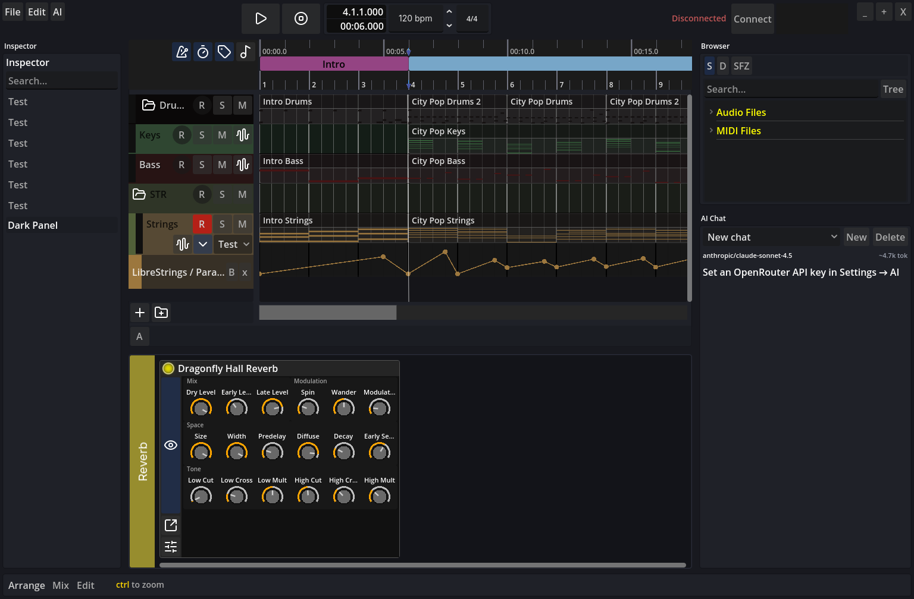

# Sonara

Linux-first DAW: Godot 4 for the UI, Rust for the audio engine, OSC between them.



> [!WARNING]
> Sonara is in early development (alpha). Expect bugs, missing features and project-format
> changes between versions. Don't trust it with work you can't afford to lose.

## Features

- **Arranger**: MIDI and audio clips, folder tracks, song markers, snapping and zoom.
- **Clip editor**: piano-roll MIDI editing.
- **Mixer**: instrument, audio and bus channels with sends, pan modes, metering and routing to
  hardware outputs.
- **Automation**: volume, pan, send and device-parameter lanes with linear and step curves.
- **Built-in devices**: polysynth, sampler, SFZ sampler (sfizz), drum machine, delay, spectrum
  analyzer, plus Chain and Layer containers for nesting devices.
- **CLAP plugins**: hosted out of process, so a crashing plugin can't take the engine down. Crashed
  plugins can be reloaded with their state. Plugins can share host processes (per plugin, per
  vendor or all together). Plugin GUIs are supported, and plugins without one get a generated
  panel.
- **Live MIDI**: MIDI keyboards and a virtual keyboard, routed to armed channels.
- **Audio settings**: pick the output device, sample rate and buffer size from the UI.
- **Asset browser**: audio files, MIDI files, SFZ instruments and devices.
- **Undo/redo** for editing.
- **AI assistant** (optional): chat that can read and edit the project, via OpenRouter.

## Current limitations

- Audio clips have limited features.
- No audio export or rendering yet.
- Linux only.

## Prerequisites

- Linux (Ubuntu/Debian/Arch/Fedora) with PipeWire, JACK or ALSA
- Rust 1.82+ ([rustup](https://rustup.rs/))
- A C/C++ toolchain, CMake and pkg-config (sfizz builds C++)
- ALSA and libsndfile headers: `sudo apt install libasound2-dev libsndfile1-dev`
  (Arch: `alsa-lib libsndfile`)
- Godot 4.7

Optional: `liblo-tools` (`oscsend`) for OSC debugging.

## Run

```bash
# Audio engine (release; debug is too slow for real-time audio)
./run_engine.sh

# UI: open Godot/ in the Godot editor, or:
godot --path Godot
```

Start the engine first. It opens the audio device, listens for OSC on UDP 7000 (replies on 7001)
and waits for Godot. Choose the output device, sample rate and buffer size in the UI's settings.

## Layout

```
Engine/            Rust audio engine, plugin host, OSC server
Godot/             Godot 4 UI
docs/subsystems/   Docs for implemented systems (keep current)
docs/adr/          Architecture decision records
docs/specs/        Feature specs (requirements, design, tasks)
docs/              Plans, research, design notes
AGENTS.md          Guide for AI coding agents (commands, architecture, conventions)
CONTEXT.md         Domain glossary
TODO.md            Backlog
STATUS.md          Notes on in-flight hard problems
```

## Development

```bash
cd Engine
cargo build --release --bins   # engine + plugin_host (both needed for CLAP)
cargo test
cargo fmt

Godot/tests/run_all.sh         # Godot tests (headless), from the repo root
```

`Engine/test_osc.sh`, `test_plugin_osc.sh` and `test_sfizz.sh` are OSC smoke tests against a
running engine. They make sound.

Logs: `Engine/logs/last_{info,warn,combined}.log` (rotated per session) and `Godot/logs/last.log`.

### Releasing

1. Run `scripts/gen_third_party_licenses.sh` (needs `cargo install cargo-about --locked --features cli`)
   and commit the updated `THIRD_PARTY_LICENSES`.
2. Tag the release commit (e.g. `v0.1.0-alpha`), so the source for every binary stays available.
3. Ship `LICENSE` and `THIRD_PARTY_LICENSES` with the binaries, and link the source repository
   from the download page.

See `AGENTS.md` for the architecture overview and `docs/subsystems/` for details.

## Conventions

- Middle C = C3 = MIDI 60
- 960 PPQ
- OSC is resource-based (`/channel/{id}/volume`, …). Catalog: `docs/subsystems/osc-protocol.md`

## Dependencies

Third-party libraries the project relies on. Versions are pinned in `Engine/Cargo.toml` and each
addon's `plugin.cfg`.

### Engine (Rust)

| Library | Role |
|--------|------|
| [cpal](https://github.com/RustAudio/cpal) | Audio I/O (PipeWire / JACK / ALSA) |
| [symphonia](https://github.com/pdeljanov/symphonia) | Decode import formats (AAC, MP3, OGG, FLAC, WAV, …) |
| [rubato](https://github.com/henquist/rubato) | Offline resampling during decode |
| [realfft](https://github.com/ejmahler/realfft) | Spectrum analyzer FFT |
| [sfizz](https://github.com/petterthowsen/rust-sfizz) (git) | Built-in SFZ sampler |
| [clack](https://github.com/prokopyl/clack) (`clack-host`, `clack-extensions`, git) | CLAP plugin hosting |
| [rosc](https://github.com/klingtnet/rosc) | OSC to/from Godot |
| [winit](https://github.com/rust-windowing/winit) + [raw-window-handle](https://github.com/rust-windowing/raw-window-handle) | Plugin GUI host windows (Linux: `x11`) |
| [libloading](https://github.com/nagisa/rust_libloading) | Dynamic CLAP library load |
| [nix](https://github.com/nix-rust/nix) / `libc` | Plugin IPC: Unix socket, shared memory, futex |
| [bincode](https://github.com/bincode-org/bincode) | Plugin IPC wire format and waveform cache |

Supporting crates (logging, serde, crossbeam, etc.) are standard plumbing; see `Engine/Cargo.toml`
for the full list.

### Godot UI

Vendored addons under `Godot/addons/`:

| Addon | Version | License | Role |
|-------|---------|---------|------|
| **GodOSC** (`godOSC`) | 0.1 | CC0 | OSC client/server in GDScript (engine comms) |
| **Godot AI** (`godot_ai`) | 4.0.4 | MIT | MCP server and editor AI tooling |

## License

Sonara is licensed under the [GNU General Public License v3.0 or later](LICENSE).
Third-party notices for everything it bundles or links are in
[THIRD_PARTY_LICENSES](THIRD_PARTY_LICENSES).

Copyright © 2026 the Sonara contributors
